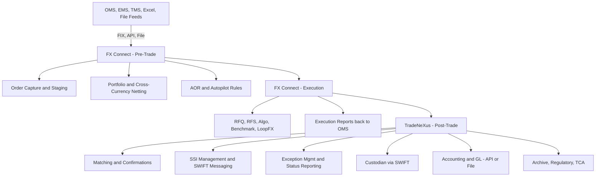
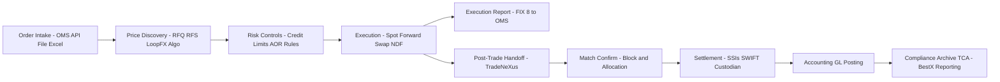

# FX Trading with State Street **FX Connect** — Integration Guide & Glossary

A practical, GitHub-friendly README that captures the FX Connect ecosystem (FX Connect + TradeNeXus + LoopFX), end-to-end workflows, connectivity patterns, illustrative FIX payloads, and a comprehensive glossary of terms and acronyms.

---

## Table of Contents

- [What Is FX Connect?](#what-is-fx-connect)
- [System Landscape & Data Flow](#system-landscape--data-flow)
- [Trade Lifecycle (Process Flow)](#trade-lifecycle-process-flow)
- [Connectivity Options](#connectivity-options)
- [Execution Styles](#execution-styles)
- [Automation & Netting](#automation--netting)
- [Post-Trade with TradeNeXus](#post-trade-with-tradenexus)
- [Sample FIX Message Patterns (Illustrative)](#sample-fix-message-patterns-illustrative)
- [Field Cookbook (Common Mappings)](#field-cookbook-common-mappings)
- [Operational Considerations](#operational-considerations)
- [Glossary (Terms & Acronyms)](#glossary-terms--acronyms)
- [Notes & Assumptions](#notes--assumptions)

---

## What Is FX Connect?

**FX Connect** is State Street’s institutional **FX execution venue** (part of GlobalLink) for buy-side clients. It supports:

- **Pre-trade**: order capture (OMS / file / API / Excel), controls, portfolio netting.
- **Execution**: Spot / Forward / Swap / NDF across RFQ/RFS, algo, benchmark, portfolio/competitive sessions, and large-ticket workflows via **LoopFX**.
- **Post-trade**: via **TradeNeXus** for matching, confirmations, SSIs, SWIFT, and exception management.

---

## System Landscape & Data Flow



---

## Trade Lifecycle (Process Flow)



---

## Connectivity Options

- **FIX**: pre/post-trade orders, quotes, executions, allocations, confirms.
- **Web Services / APIs**: push/pull orders, executions, statuses, reports.
- **File-based**: CSV/XML for batch or legacy integrations.

> If your OMS isn’t FIX-native, start with file/API ingestion and add FIX for real-time loops later.

---

## Execution Styles

- **Instrument types**: Spot, Forward, Swap, NDF  
- **Modes**: RFQ (request-for-quote), RFS (request-for-stream)  
- **Sessions**: portfolio / competitive (with auto-execution), benchmark, algo  
- **Large-ticket**: LoopFX peer-to-peer-to-bank matching

---

## Automation & Netting

- **AOR (Automated Order Router)**: rules-based routing/controls during RFS and session trading.
- **Autopilot**: fully unattended import → submit → execute → return to OMS.
- **Portfolio / Cross-currency netting**: aggregate up to ~5,000 allocations into a single net trade.

---

## Post-Trade with TradeNeXus

- **Matching & confirmations** (block → alloc level)
- **SSIs & SWIFT** messaging to custodians
- **Exception management** & status feedback to OMS/accounting
- **Audit trail & reporting**

---

## Sample FIX Message Patterns (Illustrative)

> These are examples only; align tags and UDFs with your FX Connect onboarding pack.

### 1) Spot / Forward — RFQ → Order → Execution

**QuoteRequest (R)**
```
35=R | 131=QR-20250814-001 | 146=1
55=EUR/USD | 54=1 | 38=10000000
15=USD | 64=2025-08-19 | 167=FOR
UDF_Tenor=1W | 21=1 | 60=2025-08-14T16:20:00Z
```

**NewOrderSingle (D)**
```
35=D | 11=ORD-20250814-ABC | 55=EUR/USD | 54=1
38=10000000 | 40=1 | 59=0 | 64=2025-08-19
60=2025-08-14T16:21:05Z
UDF_ExecMode=RFQ | UDF_NettingGroup=PM_FUND_X
```

**ExecutionReport (8)**
```
35=8 | 150=F | 39=2 | 17=EX1234
55=EUR/USD | LastPx=1.09325 | LastQty=10000000
32=10000000 | 31=1.09325 | 64=2025-08-19
UDF_LP=BankA | UDF_Session=RFQ | UDF_Algo=None
```

### 2) FX Swap — Linked Near/Far Orders

**Near leg**
```
35=D | 11=SWP-NEAR-001 | 55=EUR/USD | 54=1
38=10000000 | 64=2025-08-19
UDF_SwapGroupID=SWP-001 | UDF_Leg=NEAR
```

**Far leg**
```
35=D | 11=SWP-FAR-001 | 55=EUR/USD | 54=2
38=10000000 | 64=2025-09-19
UDF_SwapGroupID=SWP-001 | UDF_Leg=FAR | UDF_ForwardPts=+0.00085
```

### 3) NDF — Cash-Settled with Fixing

```
35=D | 11=NDF-20250814-77 | 55=USD/INR | 54=1
38=5000000 | 64=2025-10-15 | 167=FOR
UDF_Instrument=NDF | UDF_FixingDate=2025-10-13
UDF_FixingSource=WM/Refinitiv | UDF_SettlCcy=USD
```

---

## Field Cookbook (Common Mappings)

| Purpose | FIX Tag(s) | Notes |
|---|---|---|
| Client Order ID | `11` | Unique per OMS order |
| Instrument | `55` | e.g., `EUR/USD` |
| Side | `54` | 1=Buy base, 2=Sell base |
| Quantity | `38` | Base units |
| Order Type | `40` | 1=Market, 2=Limit |
| Price | `44` | Limit/agreed rate |
| Time In Force | `59` | 0=Day, 3=IOC, 4=FOK |
| Trade / Settle Dates | `75` / `64` | TradeDate / SettlDate |
| Quote Currency | `15` | e.g., USD |
| Tenor | UDF | If OMS lacks native tenor |
| Netting Group | UDF | Align with FX Connect |
| Swap Linkage | UDF | Correlate near/far legs |
| Execution Mode/Session | UDF | RFQ / RFS / Algo / Benchmark |
| Venue/LP Meta | UDF | For TCA lineage |
| NDF Specifics | UDF | Fixing date/source, settlement ccy |

---

## Operational Considerations

- **Last Look & Price Tolerance**: Document per LP/session.
- **TCA**: Use BestX (post-trade) / BestXecutor (pre-trade).
- **Controls & Limits**: Encode into AOR/Autopilot rules.
- **Break Management**: Define system of record for status.
- **SSIs**: Validate custodian coverage and SWIFT setup.
- **Large-Ticket**: Consider routing to LoopFX above threshold.

---

## Glossary (Terms & Acronyms)

| Term / Acronym | Definition |
|---|---|
| AOR | Automated Order Router |
| AutoPilot | End-to-end automation |
| Base / Quote | First/second currency in pair |
| Benchmark Session | Execution versus a reference rate |
| BestX | Post-trade TCA |
| BestXecutor | Pre-trade analytics |
| CLS | Continuous Linked Settlement |
| Confirmation | Post-trade affirmation of economics |
| Cross-Currency Netting | Aggregating allocations into a net trade |
| Custodian | Receives settlement instructions (SWIFT) |
| EMS | Execution Management System |
| FIX | Financial Information eXchange protocol |
| Forward | FX transaction after spot |
| Forward Points | Adjustment from spot to forward |
| FX | Foreign Exchange |
| FX Connect | State Street execution venue |
| FX Global Code | Industry conduct best practices |
| IOC / FOK | Immediate-or-Cancel / Fill-or-Kill |
| Instrument Types | Spot, Forward, Swap, NDF |
| Last Look | LP accept/reject window |
| LoopFX | Large-ticket matching |
| LP | Liquidity Provider |
| NDF | Non-Deliverable Forward |
| Netting Group | Grouping for portfolio netting |
| OMS | Order Management System |
| Pip | Minimum price increment |
| Post-Trade | Matching, confirms, SSIs, SWIFT |
| RFQ | Request For Quote |
| RFS | Request For Stream |
| Settle Date (T+N) | Trade settlement date |
| SSI | Standing Settlement Instruction |
| Spot | Standard T+2 FX trade |
| STP | Straight-Through Processing |
| Swap | Two-leg date roll |
| Tenor | Maturity bucket |
| TCA | Transaction Cost Analysis |
| TMS | Treasury Management System |
| Tom-Next | Tomorrow-Next swap |
| TradeNeXus | Post-trade platform (matching, SSIs, SWIFT) |
| WM/Refinitiv | FX fixing benchmark source |

---

## Notes & Assumptions

- FIX examples are **illustrative** only; align with your FX Connect onboarding specs and any client-specific UDFs.
- Mermaid diagrams are kept minimal and valid for GitHub’s renderer (no tables or nested code blocks inside diagrams).
