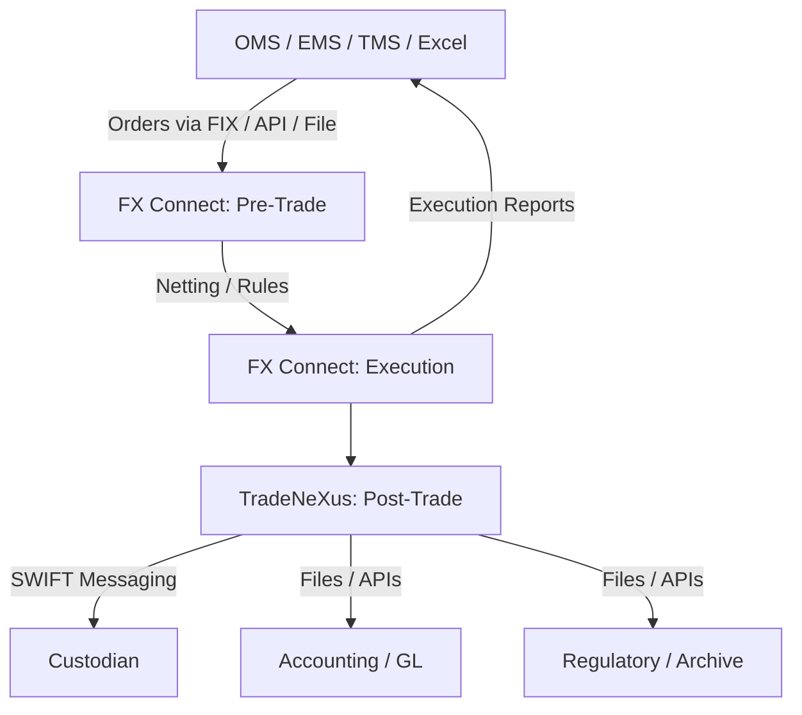
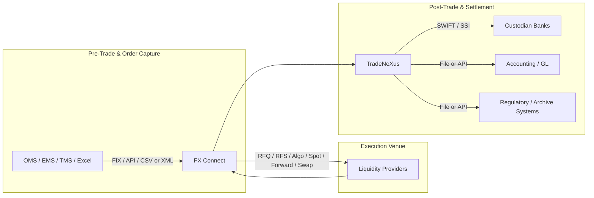
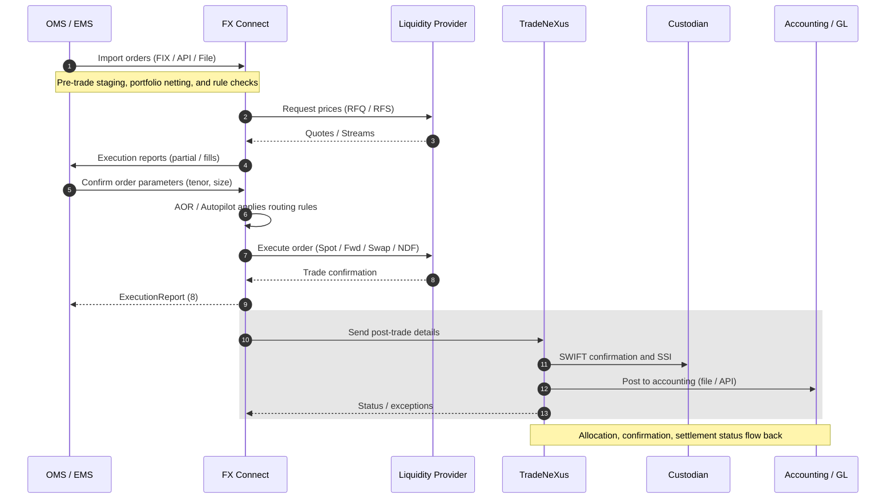
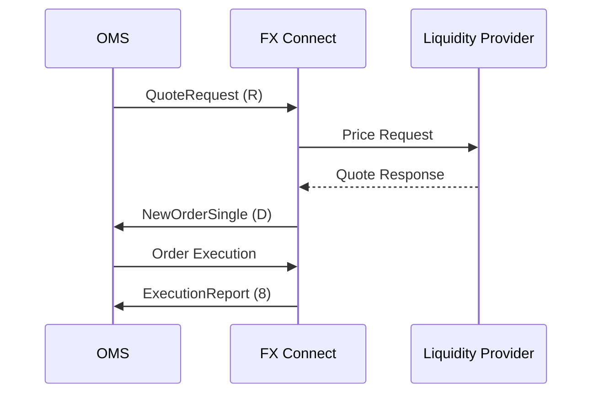

# FX Connect – Overview & Integration Guide

## Overview

**FX Connect®** is State Street’s institutional FX execution venue within the **GlobalLink™** suite, offering end-to-end FX trading workflows — **pre-trade decisioning, execution, and post-trade settlement** — with deep liquidity across hundreds of currency pairs.

It integrates with **Order Management Systems (OMS)**, **accounting systems**, and other downstream platforms to provide:
- Workflow automation
- Straight-through processing (STP)
- Multiple execution styles (Spot, Forward, Swap, NDF, Algo, RFQ, RFS, etc.)
- Integration with post-trade systems like **TradeNeXus** for matching, confirmation, and SWIFT messaging

---

## Platform-Specific Integrations

1. **TradeNeXus** – Post-trade matching, confirmation, SWIFT messaging.
2. **Automated Order Router (AOR)** – Rules-based execution during RFS sessions.
3. **Cross-Currency Netting** – Aggregates up to 5,000 allocations.
4. **Execution Styles** – Spot, Forward, Swap, NDF, RFQ, RFS, Algo, Benchmark, Portfolio sessions.
5. **Connectivity Protocols** – FIX, Web Services, file transfers (CSV/XML).
6. **Liquidity Access** – 65+ liquidity providers, 300+ spot pairs, 70 forward/swap/NDF pairs.
7. **SWIFT Custodial Designations** – 325+ custodian connections.
8. **Last Look** – Price/risk validation before execution.
9. **BestXecutor / BestX** – Pre- and post-trade transaction cost analysis.
10. **LoopFX Integration** – Large-ticket P2P-to-bank matching.
11. **FX Global Code Disclosures** – Pricing controls, last look policy.
12. **DataParser** – Compliance-focused data extraction and archiving.

---

## High-Level Workflow



---

## End-to-End Integration Path



---

## Swimlane-Style Sequence (Detailed)



---

## FIX Message Flow Example (Spot/Forward)



---

## FIX Implementation Templates

### 1) Spot / Forward (RFQ → Order → Execution)

**QuoteRequest (R) – Ask LPs for a price**
```
35=R 131=QR-20250814-001 146=1
→ NoRelatedSym[1]:
  55=EUR/USD     54=1 (Buy base)    38=10,000,000
  15=USD         64=2025-08-19      167=FOR (if forward)
  UDF_Tenor=1W   21=1 (Auto)        60=2025-08-14T16:20:00Z
```

**NewOrderSingle (D) – Lift quote / place order**
```
35=D 11=ORD-20250814-ABC    55=EUR/USD     54=1
38=10,000,000 40=1 (Market) 59=0 (Day)
64=2025-08-19 60=2025-08-14T16:21:05Z
UDF_ExecMode=RFQ   UDF_NettingGroup=PM_FUND_X
```

**ExecutionReport (8) – Fill back to OMS**
```
35=8 150=F (Trade) 39=2 (Filled) 17=EX1234
55=EUR/USD   LastPx=1.09325  LastQty=10,000,000
32=10,000,000 31=1.09325   64=2025-08-19
UDF_LP=BankA  UDF_Session=RFQ  UDF_Algo=None
```

---

### 2) FX Swap (Near + Far legs)

**Linked Orders – Near leg**
```
35=D 11=SWP-NEAR-001 55=EUR/USD 54=1 (Buy EUR)
38=10,000,000 64=2025-08-19 (SPOT+2)
UDF_SwapGroupID=SWP-001  UDF_Leg=NEAR
```

**Far leg**
```
35=D 11=SWP-FAR-001 55=EUR/USD 54=2 (Sell EUR)
38=10,000,000 64=2025-09-19 (1M)
UDF_SwapGroupID=SWP-001  UDF_Leg=FAR  UDF_ForwardPts=+0.00085
```

ExecutionReports will share `UDF_SwapGroupID`.

---

### 3) NDF (Cash-settled) with fixing

```
35=D 11=NDF-20250814-77 55=USD/INR 54=1
38=5,000,000 64=2025-10-15 167=FOR
UDF_Instrument=NDF  UDF_FixingDate=2025-10-13
UDF_FixingSource=WM/Refinitiv  UDF_SettlCcy=USD
```

---

### 4) Allocations / Confirmations / Settlement

**AllocationInstruction (J)**
```
35=J 70=ALOC-20250814-01 55=EUR/USD 64=2025-08-19
→ NoAllocs[3]:
  AllocAccount=FUND_A  AllocQty=4,000,000
  AllocAccount=FUND_B  AllocQty=3,000,000
  AllocAccount=FUND_C  AllocQty=3,000,000
UDF_BlockID=ORD-20250814-ABC  UDF_NetGroup=PM_FUND_X
```

Confirmations (AK) and settlement instructions (T) can embed custodian/SSI references.

---

## Field Mapping Reference

| Purpose | FIX Tag(s) | Notes |
|---------|-----------|-------|
| Order ID | 11 (ClOrdID) | Unique per OMS order |
| Instrument | 55 (Symbol) | e.g., "EUR/USD" |
| Side | 54 | 1=Buy base, 2=Sell base |
| Quantity | 38 | Base units (e.g., EUR) |
| Order Type | 40 | 1=Market, 2=Limit |
| Price | 44 | Limit/agreed price |
| Time In Force | 59 | 0=Day, 3=IOC, 4=FOK |
| Trade / Settl Date | 75 / 64 | Spot/forward dates |
| Currency | 15 | Quote currency |
| Tenor | UDF_Tenor | SPOT, 1W, 1M |
| Netting Group | UDF_NettingGroup | Align with FX Connect |
| Swap Link | UDF_SwapGroupID | Correlates near/far legs |
| Execution Mode | UDF_ExecMode | RFQ / RFS / Algo |
| NDF Fields | UDF_Instrument, UDF_FixingDate, UDF_FixingSource | Cash-settlement info |
| Venue Fields | UDF_Session, UDF_LP | For TCA/analytics |

---

## Automation Hooks

- **AOR** – Automated routing of trades based on rules.
- **Autopilot** – Full end-to-end automation from OMS import to execution.
- **Portfolio/Cross-Currency Netting** – Improves pricing and reduces operational load.
- **LoopFX** – Large-ticket trades routed to peer-to-peer venue.

---

## Glossary of Terms

| Term / Acronym | Description |
|----------------|-------------|
| FX | Foreign Exchange – global currency trading market |
| Spot | Immediate FX transaction, settles in 2 business days |
| Forward | Future-dated currency exchange agreement |
| Swap | Pair of offsetting FX transactions (buy/sell) |
| Tom-Next | Short-term swap from tomorrow to next day |
| NDF | Non-Deliverable Forward – cash-settled FX contract |
| Currency Pair | Quotation like EUR/USD (base/quote) |
| Synthetic Pair | Created via two trades through a common intermediary currency |
| Pip | Percentage in point – smallest price move in FX quote |
| Carry Trade | Borrow low-yield currency to buy high-yield currency |
| STP | Straight-Through Processing – no manual intervention |
| OMS | Order Management System – handles order lifecycles |
| RFQ | Request for Quote |
| RFS | Request for Stream |
| Algo | Algorithmic execution |
| FIX | Financial Information eXchange protocol |
| AOR | Automated Order Router |
| Autopilot | Fully automated execution workflow |
| LP | Liquidity Provider |
| SSI | Standard Settlement Instructions |
| SWIFT | Secure messaging network for financial transactions |
| BestX | Post-trade transaction cost analysis |
| BestXecutor | Pre-trade execution decision tool |
| LoopFX | Large-ticket peer-to-peer-to-bank liquidity venue |
| DataParser | Compliance data extraction tool |
| TCA | Transaction Cost Analysis |
| Last Look | LP validation before final execution |

---

## References
- FX Connect Product Sheet – https://www.fxconnect.com/
- FIX Protocol Overview – https://www.fixtrading.org/
- FX Global Code – https://www.globalfxc.org/
