# Foreign Exchange (FX) Trading Terms — GitHub Compatible

This README explains common FX trading terms and includes **Mermaid** flow diagrams.  
To maximize GitHub compatibility, diagrams use **simple shapes** and **no edge labels**.

## Contents
- [Blotter Session](#1-blotter-session)
- [Block Session](#2-block-session)
- [Mix Blotter and Block](#3-mix-blotter-and-block)
- [Algo Trading](#4-algo-trading)
- [Slice Trading](#5-slice-trading)
- [Allocation](#6-allocation)
- [Automated Order Router](#7-automated-order-router)
- [Basket Benchmark](#8-basket-benchmark)
- [Basket CP](#9-basket-cp)
- [Benchmark CP](#10-benchmark-cp)
- [Competitive Trading](#11-competitive-trading)
- [Portfolio Trading](#12-portfolio-trading)
- [RFQ Trading](#13-rfq-trading)
- [RFS Trading](#14-rfs-trading)
- [RFS Multivalue Date Trading](#15-rfs-multivalue-date-trading)
- [FX Trading Glossary](#fx-trading-glossary)

---

## 1. Blotter Session
A **Blotter Session** is a trading view that shows executed, working, and canceled orders/trades for a trader or desk. Refers to a trading interface or system view that displays all executed, pending, and canceled trades for a trader or trading desk within a given session.  
- Functions as an electronic "trade journal."
- Includes trade details such as currency pairs, amounts, execution rates, counterparties, timestamps, and settlement dates.
- Allows traders to monitor live trade activity and manage post-trade actions such as confirmations and allocations.
- Often integrated with back-office and middle-office systems for compliance and reporting.
- Real-time monitoring of fills, amendments, cancels.
- Key fields: pair, side, notional, rate, value date, counterparty, timestamps, status.
- Integrates with middle/back office for confirmations, allocations, and reporting.

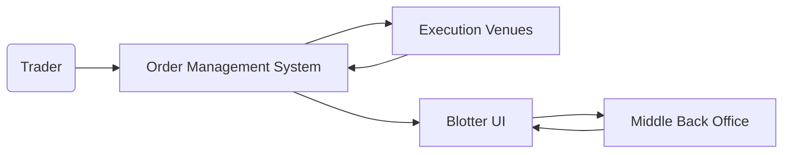

## 2. Block Session
A **Block Session** enables execution of large FX tickets (blocks) in a single or negotiated trade. Is a trading session designed for executing large FX trades (blocks) in a single transaction rather than splitting them into smaller trades.  
- Reduces market exposure by limiting the time a large order is in the market.
- Typically negotiated directly with counterparties or via platforms that support block trade functionality.
- May require pre-arranged credit limits and agreements due to trade size.
- Used by institutions to manage large position adjustments or client flows.
- Minimizes signaling and market impact.
- Often requires pre-negotiated credit and custom workflows.

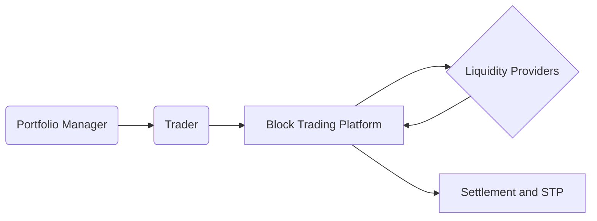

## 3. Mix Blotter and Block
A **hybrid session** combining a live blotter with block-trade capabilities in one interface. Refers to a hybrid trading session where both blotter-style trade monitoring and block trade execution capabilities are available.  
- Allows traders to handle both high-frequency, smaller trades and occasional large block trades within the same interface.
- Useful for portfolio managers executing both routine hedging trades and large strategic trades.
- Supports workflow efficiency by consolidating trade types into a single system.
- Single pane of glass for day-to-day flow and large tickets.

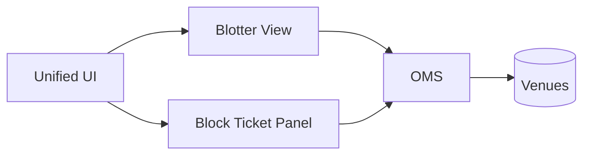

## 4. Algo Trading
**Algorithmic execution** uses strategies (e.g., TWAP, VWAP, POV) to optimize execution quality and reduce impact. In FX uses pre-programmed execution strategies to trade currency pairs automatically.  
- Can optimize execution to minimize market impact, reduce transaction costs, or follow a benchmark.
- Examples include Time-Weighted Average Price (TWAP), Volume-Weighted Average Price (VWAP), and arrival price algorithms.
- Used heavily by institutions to manage execution of large orders across multiple venues.
- Reduces human error and provides execution consistency.

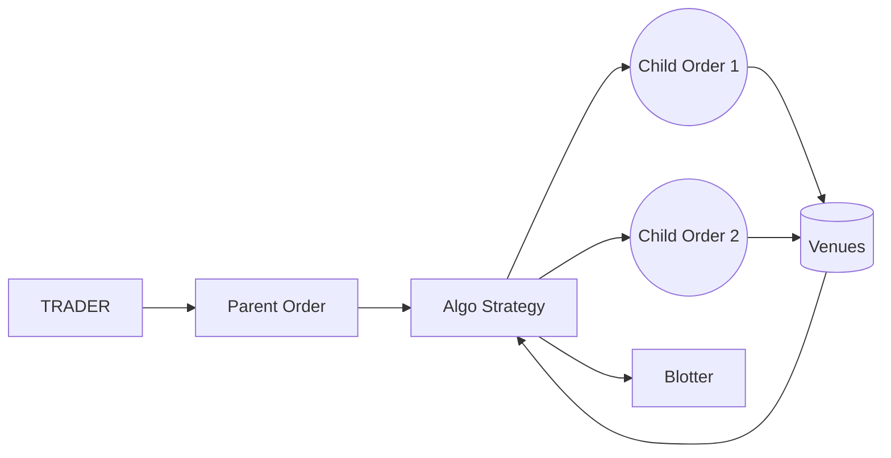

## 5. Slice Trading
**Slice Trading** breaks a large order into smaller pieces—manual or algo-driven. iInvolves breaking a large FX order into multiple smaller "slices" to execute over a set time period or according to market conditions.  
- Objective is to reduce market impact and avoid signaling a large position to the market.
- Slices may be executed manually or by an algorithm.
- Often tied to algo trading strategies like TWAP or POV (Participation of Volume).

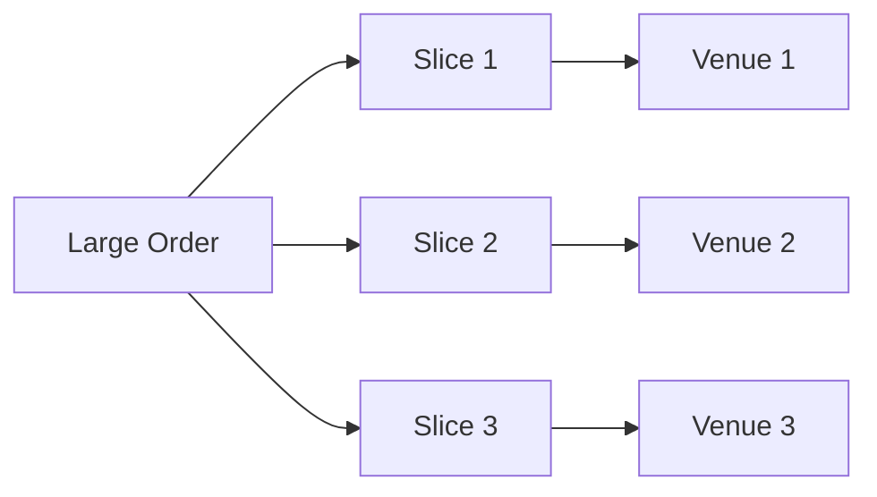

## 6. Allocation
**Allocation** assigns portions of a filled trade to funds/accounts post-execution or via pre-trade rules. Is the process of assigning portions of an executed FX trade to different underlying accounts, funds, or clients.  
- Common in asset management and fund trading, where a single trade is executed on behalf of multiple portfolios.
- Post-trade allocation ensures accurate record-keeping and compliance with investment mandates.
- Can be done manually or automatically via straight-through processing (STP).

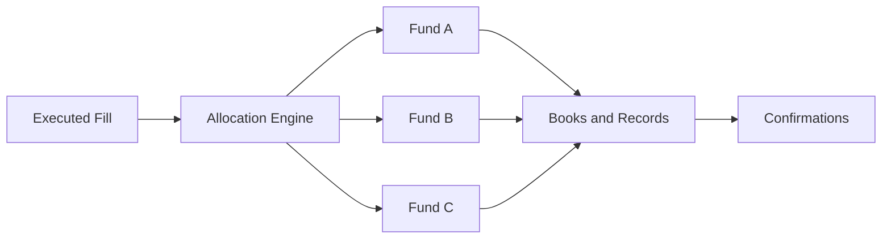

## 7. Automated Order Router
An **Automated Order Router (AOR)** routes orders to venues using rules and real-time signals. Is a system component that directs FX orders to the most appropriate execution venue based on predefined rules.  
- Factors include price, liquidity, counterparty relationships, and time sensitivity.
- May be integrated with smart order routing (SOR) to achieve best execution.
- Reduces manual intervention and speeds up order processing.

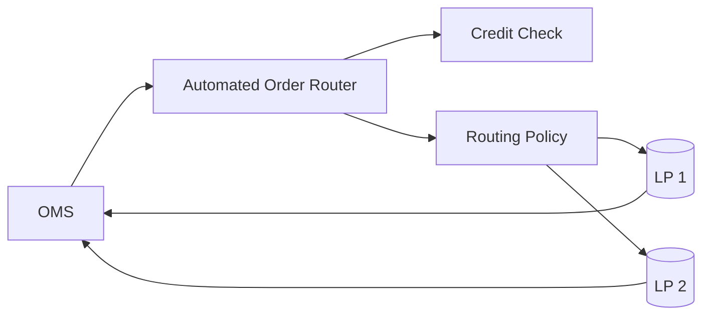

## 8. Basket Benchmark
Execute a multi-currency **basket** against a **benchmark** (e.g., WM 4pm). refers to executing or evaluating a set ("basket") of FX trades against a specific benchmark rate.  
- Used when managing multi-currency portfolios that require simultaneous execution across several currency pairs.
- Benchmark can be a market fix (e.g., WM/Reuters 4pm fix) or a time-weighted rate.
- Allows performance measurement against standardized rates.

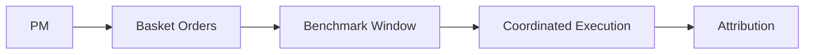

## 9. Basket CP
Execute a **basket** with a single **counterparty** to simplify operations and credit. Involves executing a multi-currency basket trade with a single counterparty.  
- Consolidates settlement and credit risk with one institution.
- Reduces operational complexity compared to executing each leg with different counterparties.
- Useful in hedging or rebalancing multi-currency exposures.

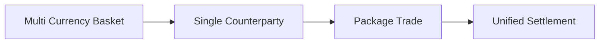

## 10. Benchmark CP
Execute with a designated **counterparty** who provides **benchmark-based** pricing (e.g., guaranteed fix). Is when a trader executes FX trades against benchmark rates specifically with a designated counterparty.  
- Counterparty may offer guaranteed benchmark pricing at market fixes.
- Common in passive fund management and index tracking.
- Can be used for performance attribution and compliance with client mandates.

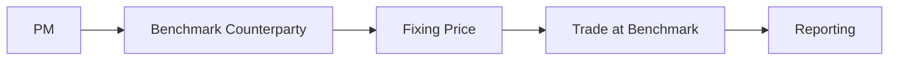

## 11. Competitive Trading
Multiple LPs compete to quote; trader selects the best price. In FX is a workflow where multiple counterparties provide price quotes for the same trade, and the trader selects the best rate.  
- Commonly implemented via electronic RFQ (Request for Quote) systems.
- Encourages tighter spreads and competitive pricing.
- Useful for trades that are large enough to benefit from direct counterparty competition.

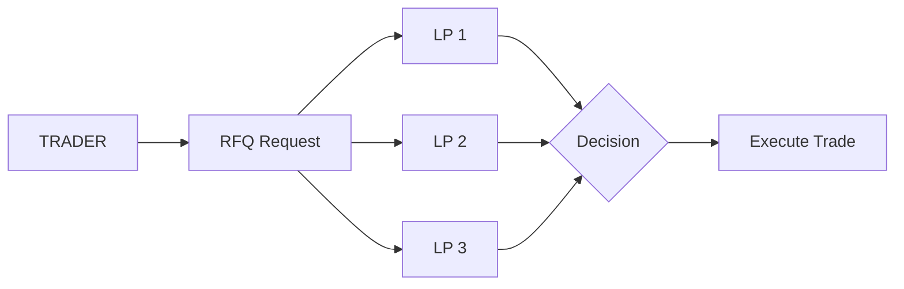

## 12. Portfolio Trading
Execute a **set of trades** as part of a portfolio-wide optimization. In FX refers to executing a group of trades as part of a portfolio-wide strategy rather than individually.  
- Often involves multi-currency baskets, netting offsetting trades across the portfolio.
- Reduces transaction costs by optimizing execution sequencing.
- Can be combined with algorithmic strategies to achieve benchmark performance.

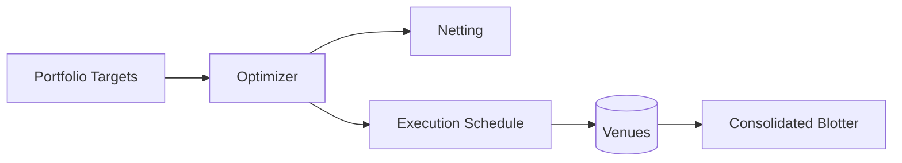

## 13. RFQ Trading
**Request for Quote (RFQ)**: solicit quotes for a specific ticket; accept the best. Is a workflow where a trader requests price quotes for a specific FX trade from one or more counterparties.  
- The trader then chooses whether to accept or reject the provided quotes.
- Common in both voice and electronic trading.
- Suitable for one-off or large trades where best pricing needs confirmation.

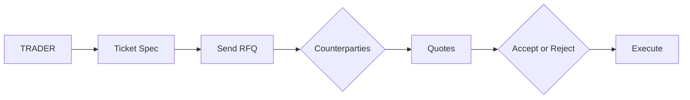

## 14. RFS Trading
**Request for Stream (RFS)**: counterparty streams updating executable prices for a defined time/size. Allows traders to request continuous, executable price streams from counterparties for a specified amount and time period.  
- Unlike RFQ, where quotes are static, RFS prices can update dynamically during the streaming session.
- Allows the trader to execute multiple trades during the streaming window.
- Useful for executing a series of trades efficiently with a single counterparty.

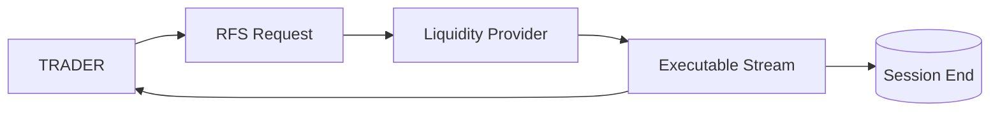

## 15. RFS Multivalue Date Trading
RFS variant enabling **multiple value dates** within the same streaming session. Is a variant of RFS where multiple value dates (settlement dates) can be traded within the same streaming session.  
- Allows execution of different forward or spot trades with varying settlement dates in one workflow.
- Reduces operational effort when managing complex cash flow needs.
- Particularly useful for corporate treasurers and fund managers managing staggered currency settlements.

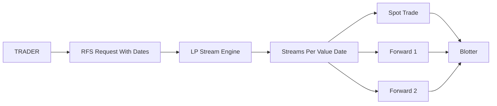

---

## FX Trading Glossary

| Term / Acronym | Meaning |
| --- | --- |
| AOR | Automated Order Router – System for directing orders to the best venue based on rules. |
| Algo Trading | Algorithmic Trading – Execution using pre-programmed strategies to optimize fills. |
| Allocation | Process of assigning executed trade portions to specific accounts or funds. |
| Basket Benchmark | Execution of multiple trades as a basket against a defined benchmark rate. |
| Basket CP | Basket Counterparty – Executing a basket trade with a single counterparty. |
| Benchmark CP | Benchmark Counterparty – Executing trades at benchmark rates with a specific counterparty. |
| Blotter Session | Trade monitoring session showing executed, working, and canceled trades. |
| Block Session | Trading session for executing large trades (blocks) in a single transaction. |
| CP | Counterparty – The institution or entity on the other side of a trade. |
| ECN | Electronic Communication Network – Electronic system that matches buy and sell orders. |
| EMS | Execution Management System – Platform for routing and executing orders. |
| Fix | Market fixing rate, often used as a benchmark (e.g., WM/Reuters 4pm). |
| IS | Implementation Shortfall – Difference between decision price and execution price. |
| KPI | Key Performance Indicator – Metric for measuring execution or operational performance. |
| Last Look | Liquidity provider practice of checking order validity before execution, may reject. |
| LP | Liquidity Provider – Bank or institution providing tradable prices. |
| OMS | Order Management System – System for managing and tracking orders. |
| POV | Participation of Volume – Algo that participates in market volume at a set rate. |
| RFQ | Request for Quote – Workflow where trader requests a price for a specific trade. |
| RFS | Request for Stream – Workflow where trader requests continuous executable prices. |
| RFS Multivalue Date | Streaming workflow allowing trades with multiple settlement dates. |
| Slice Trading | Breaking a large order into smaller slices to reduce market impact. |
| STP | Straight-Through Processing – Automated, touchless post-trade processing. |
| TWAP | Time-Weighted Average Price – Execution strategy spreading trades evenly over time. |
| VWAP | Volume-Weighted Average Price – Execution strategy weighted by traded volume. |
