# Foreign Exchange (FX) Trading Terms — GitHub Compatible

This README explains common FX trading terms and includes **Mermaid** flow diagrams.  
To maximize GitHub compatibility, diagrams use **simple shapes** and **no edge labels**.

## Contents
- [Blotter Session](#1-blotter-session)
- [Block Session](#2-block-session)
- [Mix Blotter and Block](#3-mix-blotter-and-block)
- [Algo Trading](#4-algo-trading)
- [Slice Trading](#5-slice-trading)
- [Allocation](#6-allocation)
- [Automated Order Router](#7-automated-order-router)
- [Basket Benchmark](#8-basket-benchmark)
- [Basket CP](#9-basket-cp)
- [Benchmark CP](#10-benchmark-cp)
- [Competitive Trading](#11-competitive-trading)
- [Portfolio Trading](#12-portfolio-trading)
- [RFQ Trading](#13-rfq-trading)
- [RFS Trading](#14-rfs-trading)
- [RFS Multivalue Date Trading](#15-rfs-multivalue-date-trading)

---

## 1. Blotter Session
A **Blotter Session** is a trading view that shows executed, working, and canceled orders/trades for a trader or desk. Refers to a trading interface or system view that displays all executed, pending, and canceled trades for a trader or trading desk within a given session.  
- Functions as an electronic "trade journal."
- Includes trade details such as currency pairs, amounts, execution rates, counterparties, timestamps, and settlement dates.
- Allows traders to monitor live trade activity and manage post-trade actions such as confirmations and allocations.
- Often integrated with back-office and middle-office systems for compliance and reporting.
- Real-time monitoring of fills, amendments, cancels.
- Key fields: pair, side, notional, rate, value date, counterparty, timestamps, status.
- Integrates with middle/back office for confirmations, allocations, and reporting.

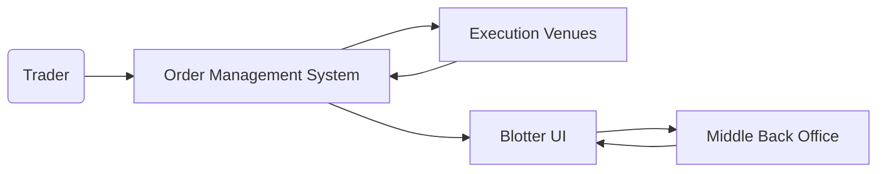

## 2. Block Session
A **Block Session** enables execution of large FX tickets (blocks) in a single or negotiated trade. Is a trading session designed for executing large FX trades (blocks) in a single transaction rather than splitting them into smaller trades.  
- Reduces market exposure by limiting the time a large order is in the market.
- Typically negotiated directly with counterparties or via platforms that support block trade functionality.
- May require pre-arranged credit limits and agreements due to trade size.
- Used by institutions to manage large position adjustments or client flows.
- Minimizes signaling and market impact.
- Often requires pre-negotiated credit and custom workflows.

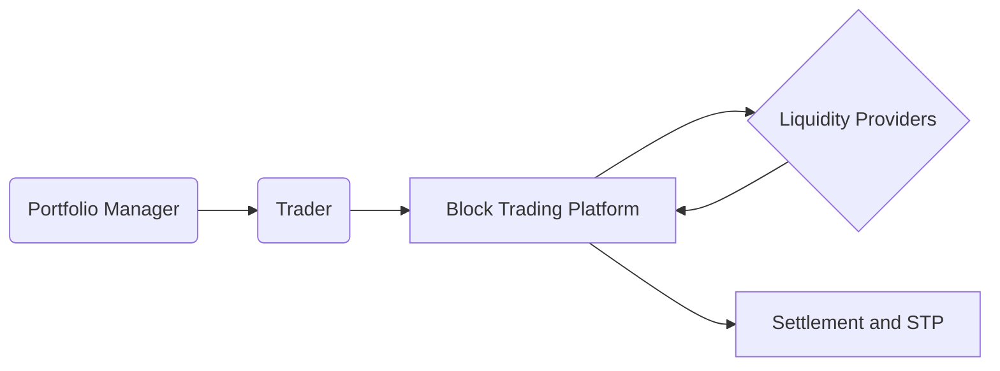

## 3. Mix Blotter and Block
A **hybrid session** combining a live blotter with block-trade capabilities in one interface.
- Single pane of glass for day-to-day flow and large tickets.

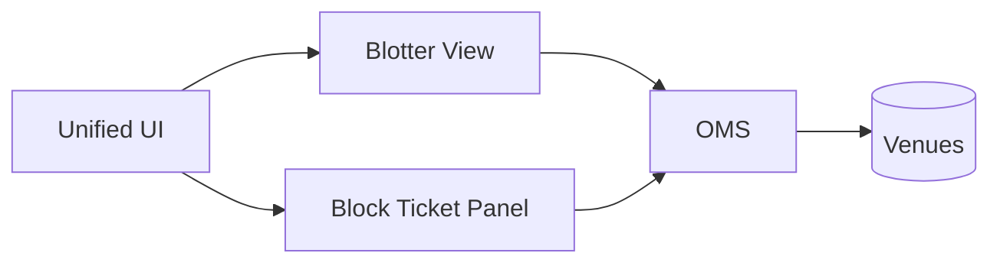

## 4. Algo Trading
**Algorithmic execution** uses strategies (e.g., TWAP, VWAP, POV) to optimize execution quality and reduce impact.

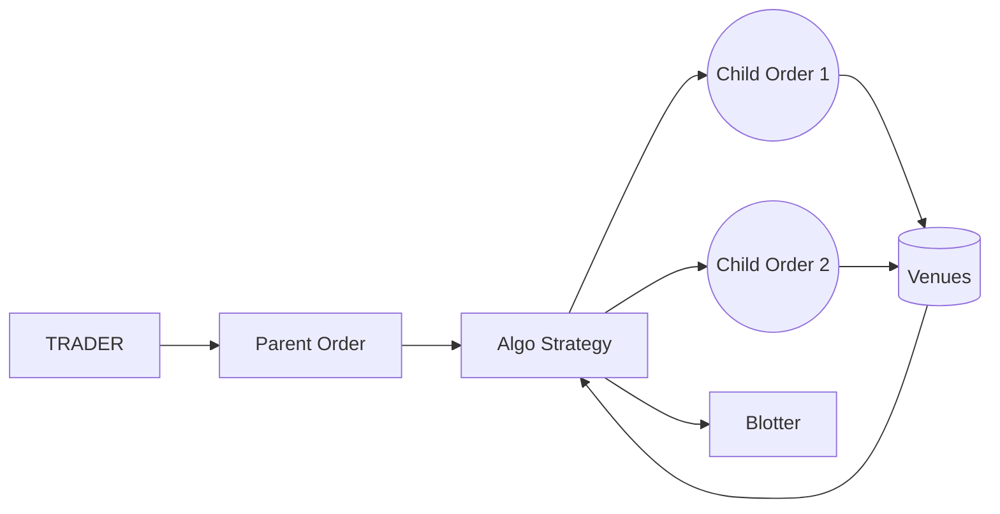

## 5. Slice Trading
**Slice Trading** breaks a large order into smaller pieces—manual or algo-driven.

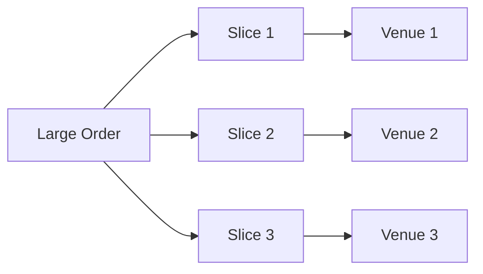

## 6. Allocation
**Allocation** assigns portions of a filled trade to funds/accounts post-execution or via pre-trade rules.

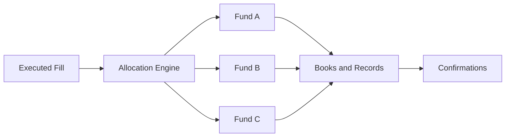

## 7. Automated Order Router
An **Automated Order Router (AOR)** routes orders to venues using rules and real-time signals.

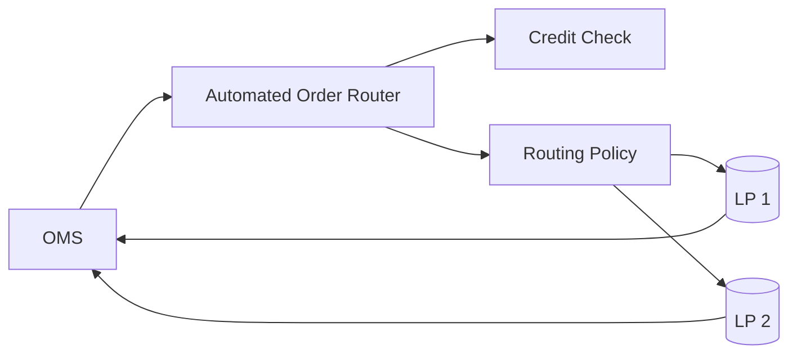

## 8. Basket Benchmark
Execute a multi-currency **basket** against a **benchmark** (e.g., WM 4pm).

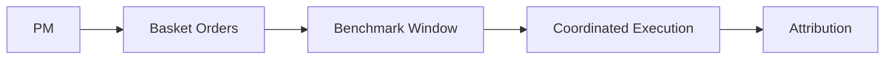

## 9. Basket CP
Execute a **basket** with a single **counterparty** to simplify operations and credit.

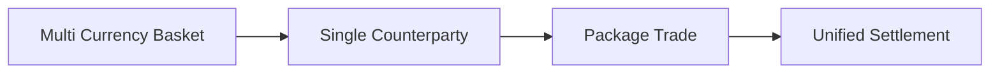

## 10. Benchmark CP
Execute with a designated **counterparty** who provides **benchmark-based** pricing (e.g., guaranteed fix).

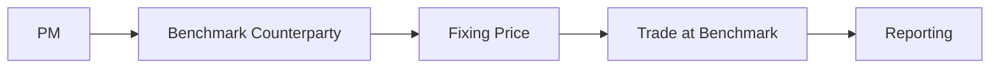

## 11. Competitive Trading
Multiple LPs compete to quote; trader selects the best price.

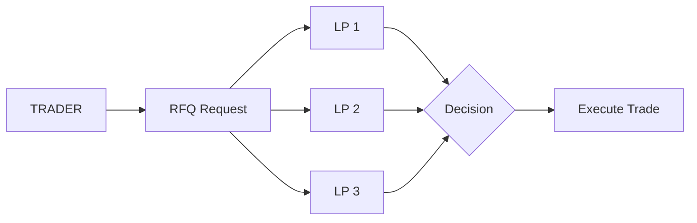

## 12. Portfolio Trading
Execute a **set of trades** as part of a portfolio-wide optimization.

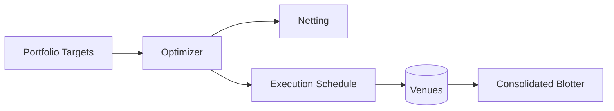

## 13. RFQ Trading
**Request for Quote (RFQ)**: solicit quotes for a specific ticket; accept the best.

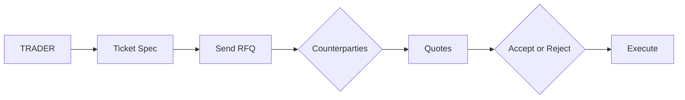

## 14. RFS Trading
**Request for Stream (RFS)**: counterparty streams updating executable prices for a defined time/size.

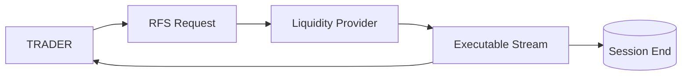

## 15. RFS Multivalue Date Trading
RFS variant enabling **multiple value dates** within the same streaming session.

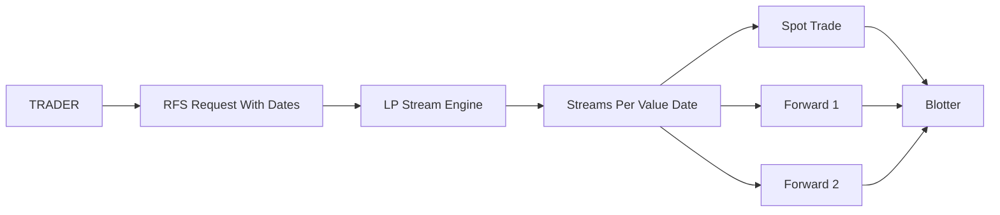

---

### Notes
- Keep Mermaid blocks fenced with triple backticks and a blank line before and after each block.
- Avoid special characters in edge labels; this README omits edge labels for maximum compatibility.
