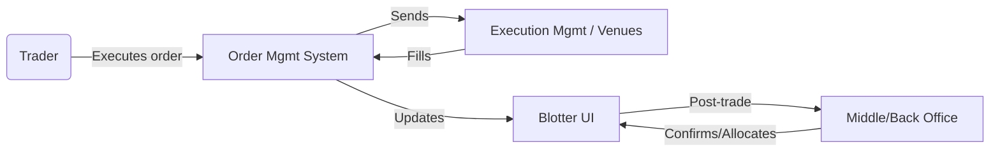
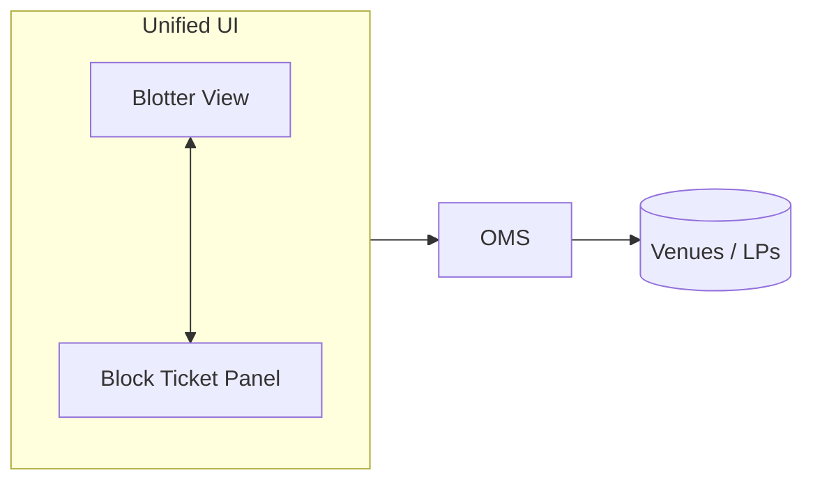
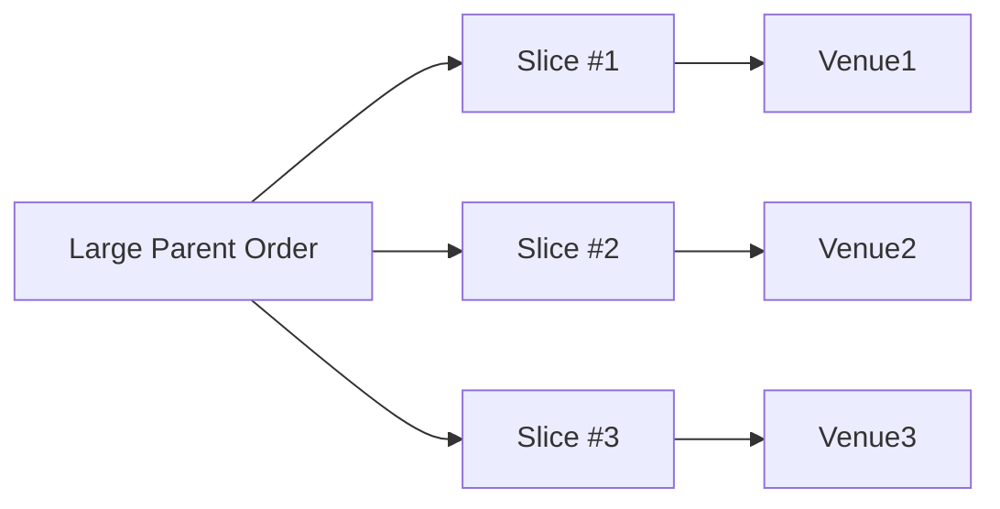
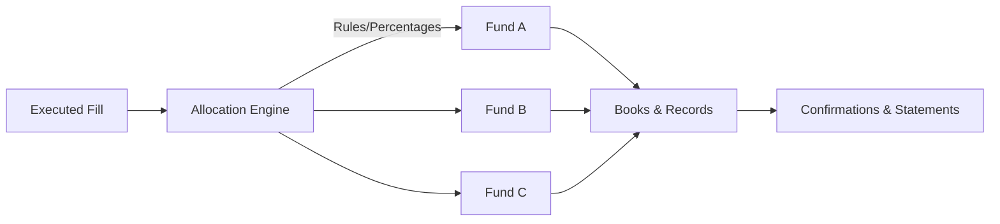
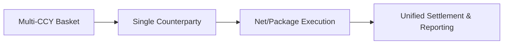
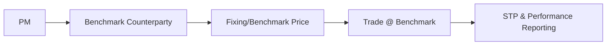
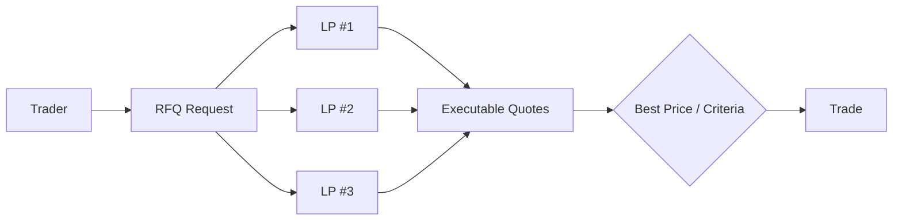
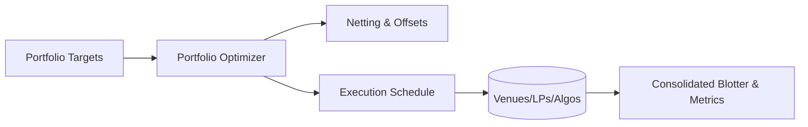

# Foreign Exchange (FX) Trading Terms — With Visual Workflows

This document explains common FX trading terms used in institutional and electronic trading, and includes **Mermaid flow diagrams** to visualize typical workflows. You can preview these diagrams in any Markdown viewer that supports Mermaid (e.g., GitHub, VS Code with the Mermaid extension).

---

## Contents
- [Blotter Session](#1-blotter-session)
- [Block Session](#2-block-session)
- [Mix Blotter and Block](#3-mix-blotter-and-block)
- [Algo Trading](#4-algo-trading)
- [Slice Trading](#5-slice-trading)
- [Allocation](#6-allocation)
- [Automated Order Router](#7-automated-order-router)
- [Basket Benchmark](#8-basket-benchmark)
- [Basket CP](#9-basket-cp)
- [Benchmark CP](#10-benchmark-cp)
- [Competitive Trading](#11-competitive-trading)
- [Portfolio Trading](#12-portfolio-trading)
- [RFQ Trading](#13-rfq-trading)
- [RFS Trading](#14-rfs-trading)
- [RFS Multivalue Date Trading](#15-rfs-multivalue-date-trading)

---

## 1. Blotter Session
A **Blotter Session** is a trading view that shows executed, working, and canceled orders/trades for a trader or desk.
- Real-time monitoring of fills, amendments, cancels.
- Key fields: CCY pair, side, notional, rate, value date, counterparty, timestamps, status.
- Hooks into middle/back office for confirmations, allocations, and reporting.



---

## 2. Block Session
A **Block Session** enables execution of large FX tickets (blocks) in a single or negotiated trade.
- Minimizes signaling/market impact.
- Often requires pre-negotiated credit and bespoke workflows.

```mermaid
flowchart LR
  PM(Portfolio Manager) -->|Large Instruction| Trader
  Trader -->|Initiates Block| Platform[Block-Capable Platform]
  Platform -->|Negotiates| LPs{Liquidity Providers}
  LPs -->|Block Quote(s)| Platform
  Platform -->|Execute Best| Settlement[STP to Middle/Back Office]
```

---

## 3. Mix Blotter and Block
A **hybrid session** combining a live blotter with block-trade capabilities in one interface.
- Single pane of glass for day-to-day flow and occasional large tickets.



---

## 4. Algo Trading
**Algorithmic execution** uses strategies (e.g., TWAP, VWAP, POV/PoV, arrival price) to optimize execution quality and reduce impact.

```mermaid
flowchart LR
  Trader -->|Parent Order| Algo[Algo Strategy (TWAP/VWAP/POV)]
  Algo -->|Slices| Child1((Child Order n))
  Algo -->|Slices| Child2((Child Order n+1))
  Child1 --> Venues[(ECNs/LPs)]
  Child2 --> Venues
  Venues -->|Fills| Algo
  Algo -->|Metrics/Slippage| Blotter
```

**Key controls**: participation cap, max spread, min quote size, time window, benchmark target.

---

## 5. Slice Trading
**Slice Trading** breaks a large order into smaller pieces—manual or algo-driven.
- Objective: reduce footprint and time risk.



---

## 6. Allocation
**Allocation** assigns portions of a filled trade to funds/accounts post-execution (or pre-trade via block allocation rules).



---

## 7. Automated Order Router
An **Automated Order Router (AOR)** routes orders to venues using rules and real-time signals to achieve best execution.

```mermaid
flowchart LR
  OMS --> AOR[Automated Order Router]
  AOR -->|Check| Credit[Credit/Limit Check]
  AOR -->|Select| Policy[Routing Policy (Price, Liquidity, Latency)]
  Policy -->|Route| V1[(LP/ECN #1)]
  Policy -->|Route| V2[(LP/ECN #2)]
  V1 & V2 -->|Fills/Rejects| OMS
```

---

## 8. Basket Benchmark
Execute a multi-currency **basket** against a **benchmark** (e.g., WM/Reuters 4pm).

```mermaid
flowchart LR
  PM --> Basket[Basket Orders (Multi-CCY)]
  Basket --> Benchmark[Benchmark Window/Method]
  Benchmark --> Execution[Coordinated Execution]
  Execution --> Attribution[Attribution vs Benchmark]
```

---

## 9. Basket CP
Execute a **basket** with a single **counterparty** to simplify ops and credit.



---

## 10. Benchmark CP
Execute with a designated **counterparty** who provides **benchmark-based** pricing (e.g., guaranteed fix).



---

## 11. Competitive Trading
Multiple LPs compete to quote; trader selects the best price.



---

## 12. Portfolio Trading
Execute a **set of trades** as part of a portfolio-wide optimization (netting offsets, sequencing orders, minimizing costs).



---

## 13. RFQ Trading
**Request for Quote (RFQ)**: solicit quotes for a specific ticket; accept the best.

```mermaid
flowchart LR
  Trader --> Spec[Define Ticket (Pair, Notional, Date)]
  Spec --> Send[Send RFQ]
  Send --> LPs{Counterparties}
  LPs --> Replies[Quotes + Timeouts]
  Replies --> Choose{Accept/Reject}
  Choose -->|Accept| Execute[Execute Trade]
  Choose -->|Reject| End[End / Re-quote]
```

---

## 14. RFS Trading
**Request for Stream (RFS)**: counterparty streams updating executable prices for a defined time/size; trader can take multiple clips.

```mermaid
flowchart LR
  Trader --> RFSReq[RFS Request (Terms/Window)]
  RFSReq --> LP[Designated LP(s)]
  LP --> Stream[Live Executable Stream]
  Stream -->|Multiple Fills| Trader
  Stream -. Expiry .-> End[(Session Ends)]
```

---

## 15. RFS Multivalue Date Trading
RFS variant enabling **multiple value dates** within the same streaming session (spot + various forwards).

```mermaid
flowchart LR
  Trader --> RFSReq[RFS Request: Pairs, Notional, Dates[]]
  RFSReq --> LP[LP Stream Engine]
  LP --> Streams[Streams per Value Date]
  Streams --> Fill1[Trade Spot @ t0]
  Streams --> Fill2[Trade Fwd1 @ t+30]
  Streams --> Fill3[Trade Fwd2 @ t+90]
  Fill1 & Fill2 & Fill3 --> Blotter[Unified Blotter & Allocation]
```

---

### Notes & Best Practices
- **Pre-trade**: validate credit/limits, check market conditions and liquidity windows.
- **Execution**: use algorithms or routing rules aligned with your **best execution** policy.
- **Post-trade**: automate confirmations, allocations, and reconciliation (STP) to reduce operational risk.
- **Metrics**: track implementation shortfall, benchmark slippage, market impact, and fill rates.

